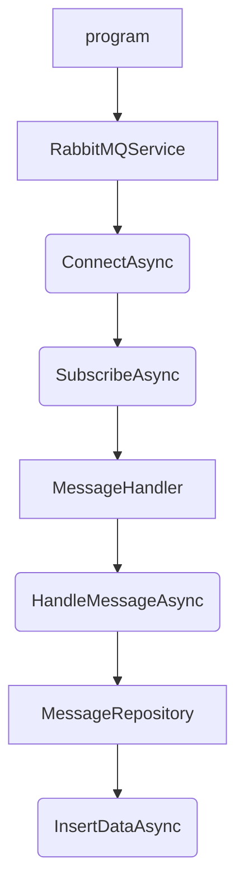

# CELSIUS 📡

## AGREGATOR

Ici le service permettant de récupérer et stocker toutes les données renvoyées par nos centaines de capteurs dans une base NoSQL

# Documentation de l'API .NET 6

Cette documentation vise à expliquer la structure, le fonctionnement et les différentes parties de l'API développée en .NET 6. L'architecture de l'API est organisée en plusieurs dossiers et fichiers pour une gestion modulaire.

## Structure de l'API

### Dossier `Configuration`

#### Fichiers :
- **`CelsiusDatabaseSettings.cs`**

Ce fichier permet de stocker les paramètres de configuration pour la base de données Celsius qui ce trouve dans **appsettings.json**.

- **`RabbitMQSettings.cs`**

Ce fichier permet de stocker les paramètres de configuration de RabbitMQ qui ce trouve dans **appsettings.json**.

### Dossier `Controllers`

#### Fichiers :
- **`DataController.cs`**

Contrôleur principal de l'API qui gère les requêtes relatives aux données.

### Dossier `Handler`

#### Fichiers :
- **`MessageHandler.cs`**

Implémente la logique de traitement des messages reçus.
Traite les données reçues, effectue des opérations de transformation et appel par la suite le repository pour insérer le résultat.

### Dossier `Models`

#### Fichiers :
- **`SensorData.cs`**

Définit la structure de données pour les capteurs.
Enregistre les données des capteurs, telles que le CO2, la température, la date, la présence, et le chauffage.

### Dossier `Repository`

#### Fichiers :
- **`MessageRepository.cs`**

Gère les opérations de récupération et d'insertion de données.

### Dossier `Services`

#### Fichiers :
- **`RabbitMQService.cs`**

Établit la connexion avec RabbitMQ et gère la réception des messages.

## Schéma de fonctionnement du flux RabbitMQ
